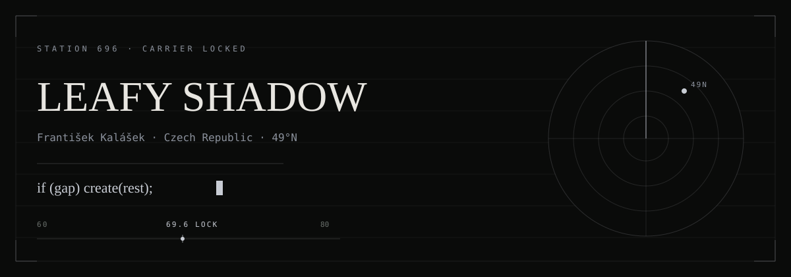
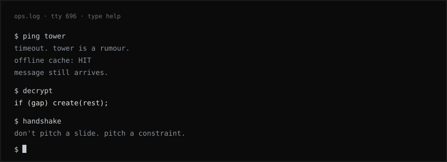
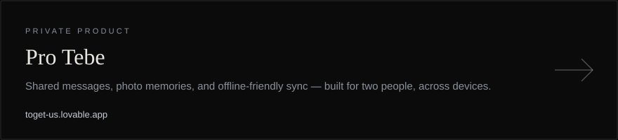
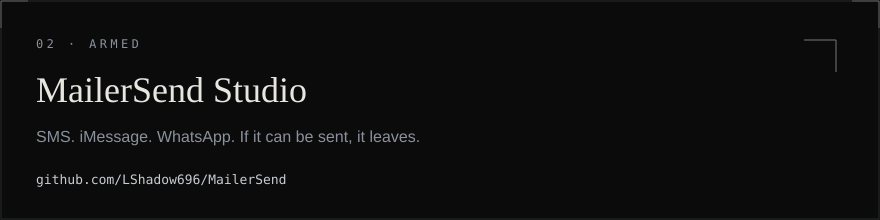

<p align="center">
  
</p>

<p align="center">
  <a href="https://fkv.me">website</a>
  &nbsp;·&nbsp;
  <a href="mailto:Lshadow696@fkv.me">transmit</a>
  &nbsp;·&nbsp;
  <a href="https://x.com/LeafyShadowQQ">x</a>
  &nbsp;·&nbsp;
  <a href="https://github.com/LShadow696">github</a>
</p>

```
if (gap) create(rest);
```

I don't ship decks. I ship the thing you keep open when the tower drops.

Two phones. A dead zone. A message that still arrives. Czech night. Dark mode. Always.

<p align="center">
  
</p>

## Missions

### 01 · Pro Tebe · LIVE

Two people. One room. Messages and photos that survive the dead zone.

<p align="center">
  <a href="https://toget-us.lovable.app"></a>
</p>

<p align="center"><sub><a href="https://toget-us.lovable.app">Enter the room</a> · private product</sub></p>

### 02 · MailerSend Studio · ARMED

SMS. iMessage. WhatsApp. One console. If it can be sent, it leaves from here.

<p align="center">
  <a href="https://github.com/LShadow696/MailerSend"></a>
</p>

<p align="center"><sub><a href="https://github.com/LShadow696/MailerSend">Open the console</a> · public repository</sub></p>

## Loadout

TypeScript · React · TanStack · Vite · Tailwind · Supabase · PostgreSQL · Node.js

## Handshake

Don't pitch me a slide. Pitch me a constraint.

[write](mailto:Lshadow696@fkv.me) · [fkv.me](https://fkv.me)

<details>
<summary>decrypt</summary>
<br/>

Bridge the gap. Create the rest.

</details>
