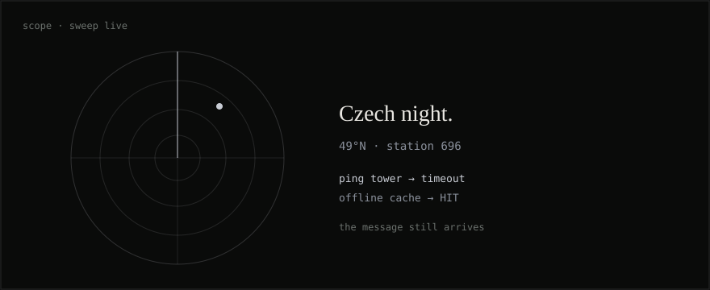
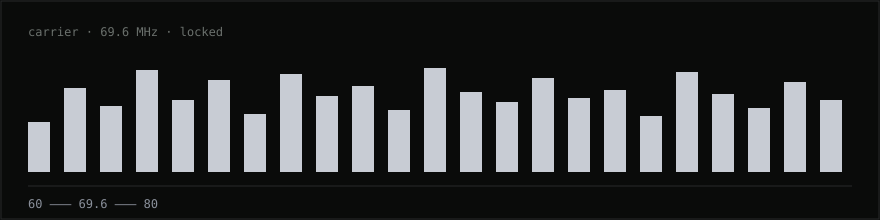
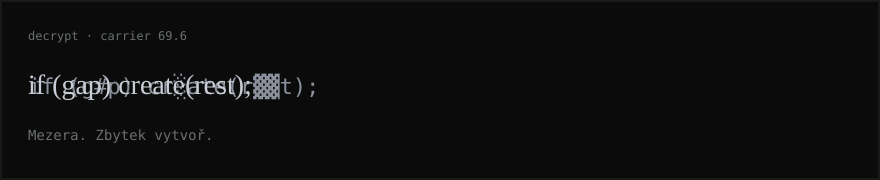

<p align="center">
  
</p>

<p align="center">
  <a href="https://fkv.me">website</a>
  &nbsp;·&nbsp;
  <a href="mailto:Lshadow696@fkv.me">transmit</a>
  &nbsp;·&nbsp;
  <a href="https://x.com/LeafyShadowQQ">x</a>
  &nbsp;·&nbsp;
  <a href="https://github.com/LShadow696">github</a>
</p>

<pre>
FREQ  69.6    LOCKED
if (gap) create(rest);
</pre>

The gap is the product. Two phones. A dead zone. A message that still arrives. Czech night. Dark mode. Always.

<table>
  <tr>
    <td width="50%"></td>
    <td width="50%"></td>
  </tr>
</table>

<p align="center">
  
</p>

## Dossiers

### 01 · Pro Tebe · LIVE

Two people. One room. Messages and photos that survive the dead zone.

<p align="center">
  <a href="https://toget-us.lovable.app"></a>
</p>

<p align="center"><sub><a href="https://toget-us.lovable.app">Enter the room</a> · private product</sub></p>

### 02 · MailerSend Studio · ARMED

SMS. iMessage. WhatsApp. One console. If it can be sent, it leaves from here.

<p align="center">
  <a href="https://github.com/LShadow696/MailerSend"></a>
</p>

<p align="center"><sub><a href="https://github.com/LShadow696/MailerSend">Open the console</a> · public repository</sub></p>

<p align="center">
  
</p>

## Handshake

Don't pitch me a slide. Pitch me a constraint.

[write](mailto:Lshadow696@fkv.me) · [fkv.me](https://fkv.me)

<details>
<summary>decrypt</summary>
<br/>

```
whoami      operator
ping        the tower (it will fail)
deadzone    drop the tower on purpose
lock        69.6
decrypt     the only line that matters
```

Bridge the gap. Create the rest.

Mezera. Zbytek vytvoř.

</details>
